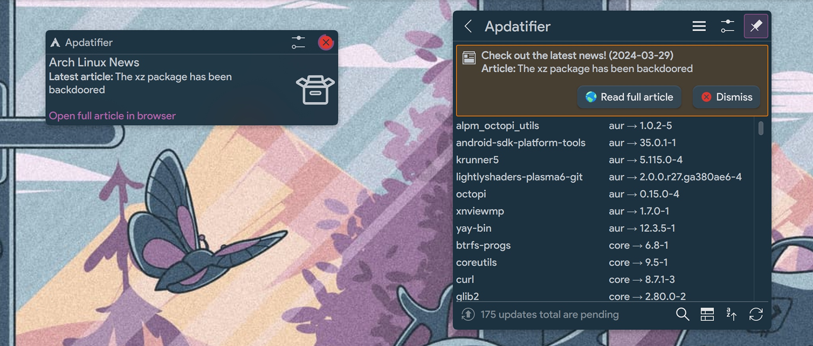

<div align="center">


<!-- 
 -->


# Apdatifier
## Arch Update Notifier

</div>

# Features
- Notification for new updates and [Arch Linux News](https://archlinux.org/news)
- Supports [AUR](#supported-pacman-wrappers), Plasmoids, Flatpak (without showing the runtime updates)
- Also should work on non-Arch-based systems (for Plasmoids and Flatpak)
- Two types of lists: compact and expanded with additional information
- Button to initiate a full system upgrade in the selected [terminal](#supported-terminals)
- Option to refresh the mirrorlist with the latest mirrors filtered by speed
- Customizable icon on the panel and package icons in the list

<br>

<div align="center">




</div>

<br>

# Requirements
[pacman-contrib](https://archlinux.org/packages/extra/x86_64/pacman-contrib) - optional, but <b>recommended</b>. For checkupdates and rankmirrors scripts.

### Supported pacman wrappers
paru, trizen, yay

### Supported terminals
alacritty, foot, gnome-terminal, konsole, kitty, lxterminal, terminator, tilix, xterm, yakuake

*yakuake used the D-Bus method runCommand. So you need installed qdbus. But in general, I do not recommend using this terminal with this plasmoid.

### Required utilities for options:
<b>Arch Linux News:</b> paru or yay<br>
<b>Plasmoids:</b> curl, jq, xmlstarlet, unzip, tar<br>
<b>Mirrorlist Generator:</b> curl, pacman-contrib<br>
<b>Refresh plasmashell:</b> qdbus<br>

<br>

# Translation
You can translate this widget into other languages, please refer to the [ReadMe.md](https://github.com/exequtic/apdatifier/blob/main/package/translate/ReadMe.md) for instructions on how to do it.

### Current status:
```markdown
|  Locale  |  Lines  | % Done|
|----------|---------|-------|
| English  |     145 |       |
| Dutch    |  47/145 |   32% |
| Russian  | 145/145 |  100% |
|----------|---------|-------|
```

<br>

# Installation

Just install directly from KDE Widget Store ("+ Add widgets..." -> "Get New Widgets..." -> "Download New Plasma Widgets").

After installation, the widget icon should <b>automatically</b> appear in the system tray.

>[!IMPORTANT]
>If you had the previous version installed, you may need to log out or restart plasmashell after installation for the new features to work properly.
>```bash
>kquitapp6 plasmashell && kstart plasmashell
>```

### Uninstall
```bash
sh ~/.local/share/plasma/plasmoids/com.github.exequtic.apdatifier/contents/tools/tools.sh uninstall
```

<br>

## Settings
<div align="center">


</div>