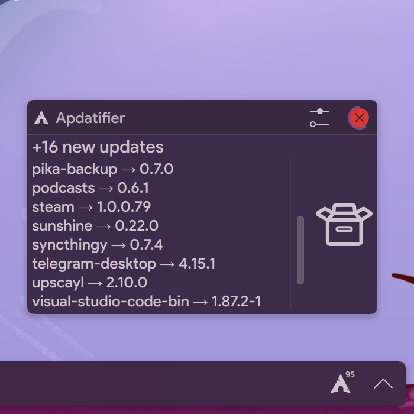
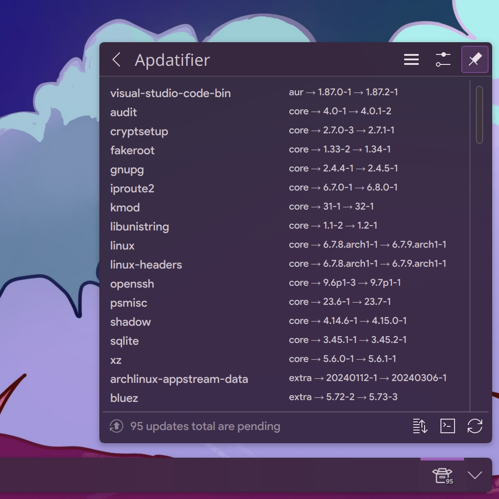
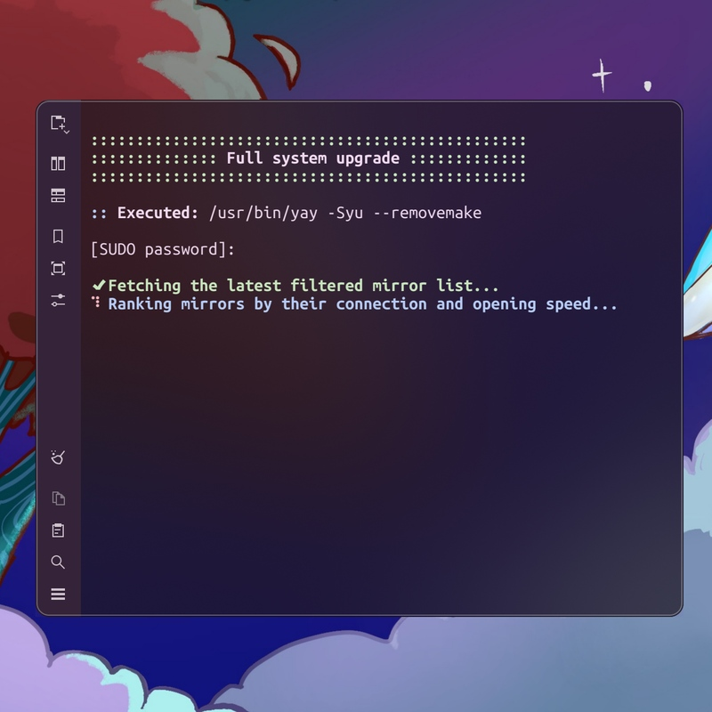
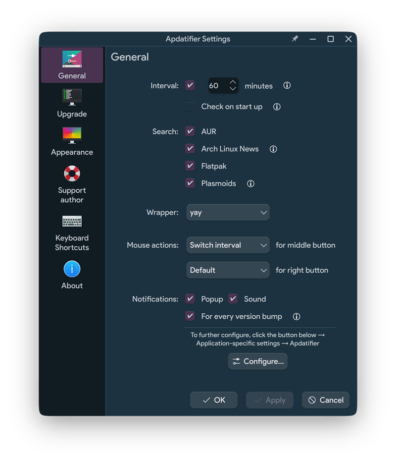
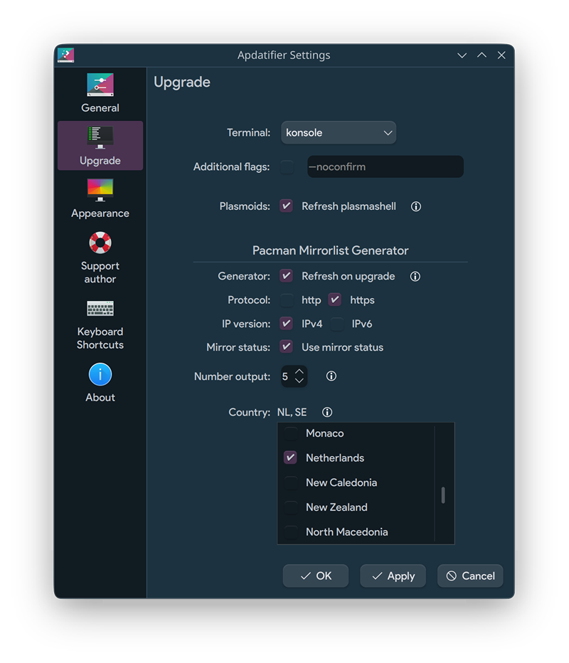
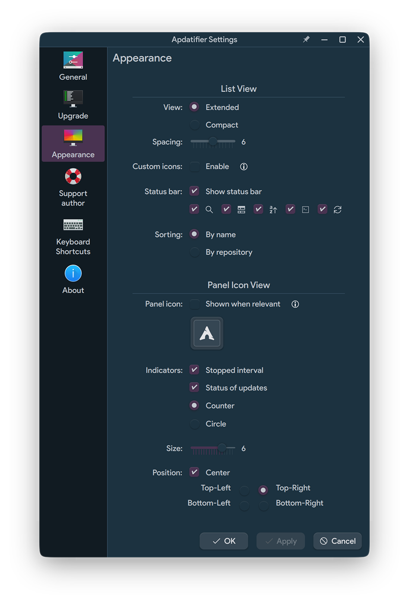

<div align="center">


<!-- 
 -->


# Apdatifier
## Arch Update Notifier

</div>

# Features
- Notification for new updates
- Supports [AUR](#supported-pacman-wrappers) and Flatpak (without showing the runtime updates)
- Button to initiate a full system upgrade in the selected [terminal](#supported-terminals)
- Option to refresh the mirrorlist with the latest mirrors filtered by speed
- Customizable icon on the panel

<br>

<div align="center">



</div>

<br>

# Requirements
[pacman-contrib](https://archlinux.org/packages/extra/x86_64/pacman-contrib) - optional, but <b>recommended</b>. For checkupdates and rankmirrors scripts.

### Supported pacman wrappers
paru, trizen, yay

### Supported terminals
alacritty, foot, gnome-terminal, konsole, kitty, lxterminal, terminator, tilix, xterm, yakuake

<br>

# Installation

Just install directly from KDE Widget Store ("+ Add widgets..." -> "Get New Widgets..." -> "Download New Plasma Widgets").

After installation, the widget icon should <b>automatically</b> appear in the system tray.

>[!WARNING]
>If you had the previous version installed, you may need to Log Out or restart plasmashell after install.
>```bash
>killall plasmashell && kstart plasmashell
>```

### Uninstall
```bash
sh ~/.local/share/plasma/plasmoids/com.github.exequtic.apdatifier/contents/tools/tools.sh uninstall
```

<br>

## Settings
<div align="center">







</div>