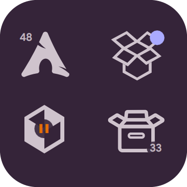
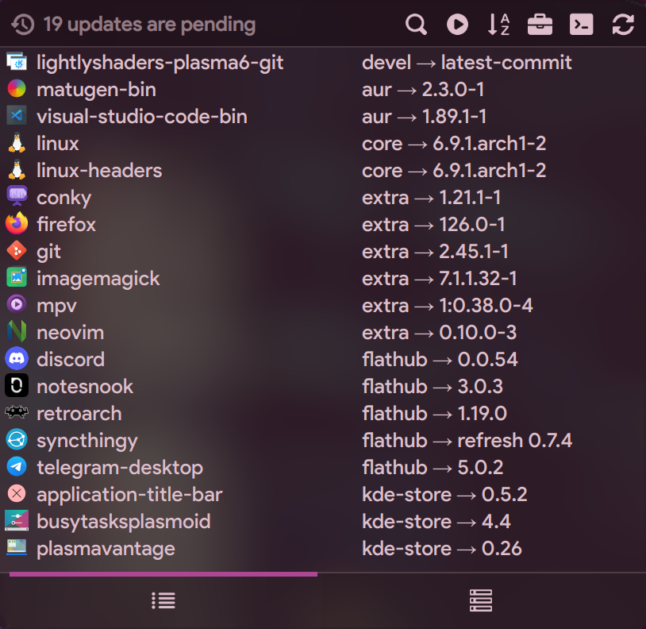
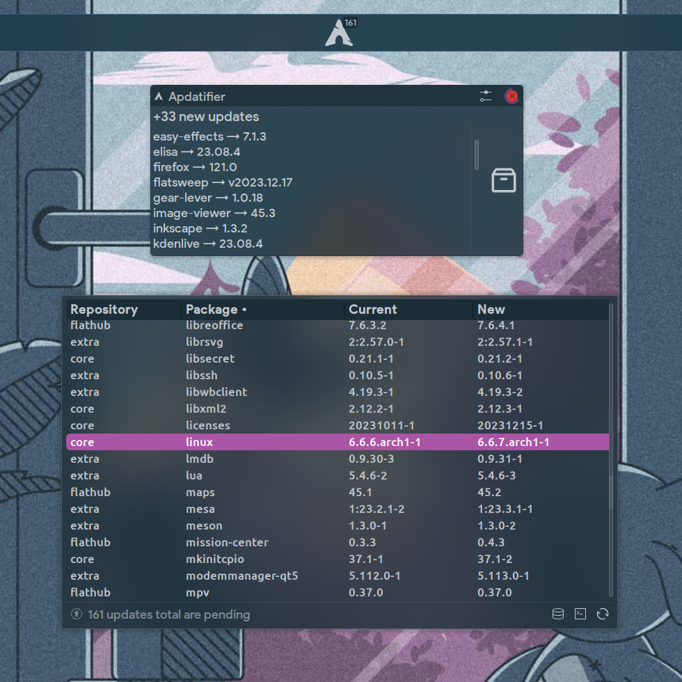
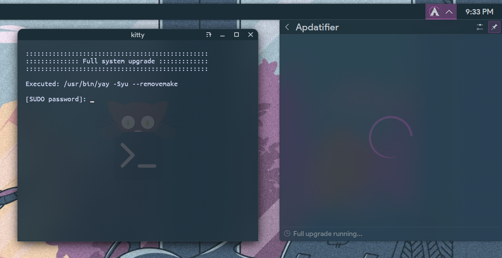
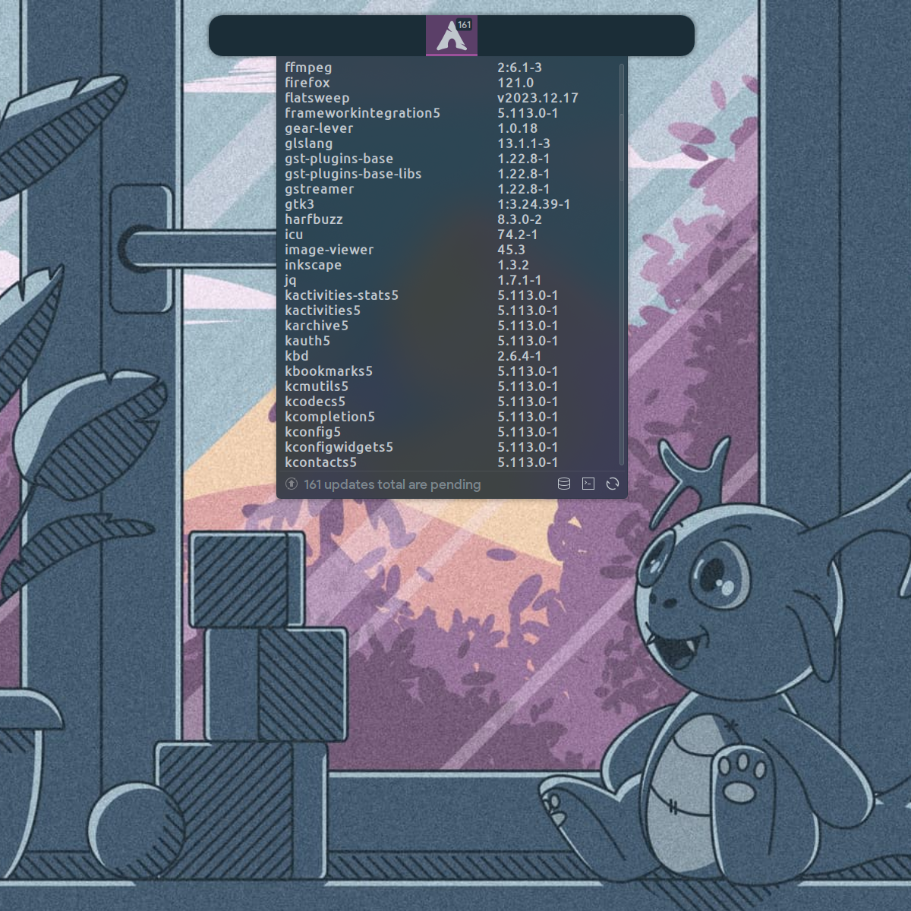

<div align="center">



<!-- 
 -->


# Apdatifier
## Arch Update Notifier

</div>

# Features
- Notification for new updates and [Arch Linux News](https://archlinux.org/news)
- Searching updates for [AUR](https://aur.archlinux.org/packages), [Plasma Widgets](https://store.kde.org/browse?cat=705), [Flatpak](https://flathub.org) (without showing the runtime updates)
- Bash script with useful options for managing packages
- Two types of lists: compact and extended with additional information
- Button to initiate a full system upgrade in the selected [terminal](#supported-terminals)
- Option to refresh the [mirrorlist](https://archlinux.org/mirrorlist) with the latest mirrors filtered by speed
- Customizable icon on the panel and package icons in the list
- Also should work on non-Arch-based systems (for Plasma Widgets and Flatpak)

<br>

# Screenshots

<div align="center">

#### Compact/Extended list

&nbsp;&nbsp;&nbsp;

&nbsp;&nbsp;&nbsp;

<br>

#### Full system upgrade


<br>

#### Management


<br><br>

https://github.com/exequtic/apdatifier/assets/29355358/9751fc8f-29c2-4f7d-8f1f-c346c0748df3

</div>

<br>

# Requirements
[pacman-contrib](https://archlinux.org/packages/extra/x86_64/pacman-contrib) - optional, but <b>HIGHLY RECOMMENDED</b>. For checkupdates and rankmirrors scripts.

### Supported pacman wrappers
paru, trizen, yay

### Supported terminals
alacritty, foot, gnome-terminal, konsole, kitty, lxterminal, terminator, tilix, xterm, *yakuake

*yakuake used the D-Bus method runCommand via the qdbus6.

### Required utilities for options:
<b>Arch Linux News:</b> [paru](https://aur.archlinux.org/packages/paru) or [yay](https://aur.archlinux.org/packages/yay)<br>
<b>Plasma Widgets:</b> [curl](https://archlinux.org/packages/core/x86_64/curl), [jq](https://archlinux.org/packages/extra/x86_64/jq), [xmlstarlet](https://archlinux.org/packages/extra/x86_64/xmlstarlet), [unzip](https://archlinux.org/packages/extra/x86_64/unzip), [tar](https://archlinux.org/packages/core/x86_64/tar)<br>
<b>Mirrorlist Generator:</b> [curl](https://archlinux.org/packages/core/x86_64/curl), [pacman-contrib](https://archlinux.org/packages/extra/x86_64/pacman-contrib)<br>
<b>Management</b>: [fzf](https://archlinux.org/packages/extra/x86_64/fzf)<br>

<br>

# Translation
Feel free to help translate to new languages or update and improve the ones that are already available. Please refer to the [ReadMe.md](https://github.com/exequtic/apdatifier/blob/main/package/translate/ReadMe.md) for instructions on how to do it.

### Current status:
```markdown
|  Locale  |  Lines  | % Done|
|----------|---------|-------|
| English  |     185 |       |
| Dutch    | 185/185 |  100% |
| French   | 185/185 |  100% |
| Russian  | 185/185 |  100% |
|----------|---------|-------|
```

<br>

# Installation

Just install directly from KDE Widget Store ("+ Add widgets..." -> "Get New Widgets..." -> "Download New Plasma Widgets").

After installation, the widget icon should <b>automatically</b> appear in the system tray.

>[!IMPORTANT]
>If you had the previous version installed, you need to log out or restart plasmashell after installation for the new features to work properly.
>```bash
>kquitapp6 plasmashell && kstart plasmashell
>```

### Uninstall
```bash
bash ~/.local/share/plasma/plasmoids/com.github.exequtic.apdatifier/contents/tools/tools.sh uninstall
```

<br>

