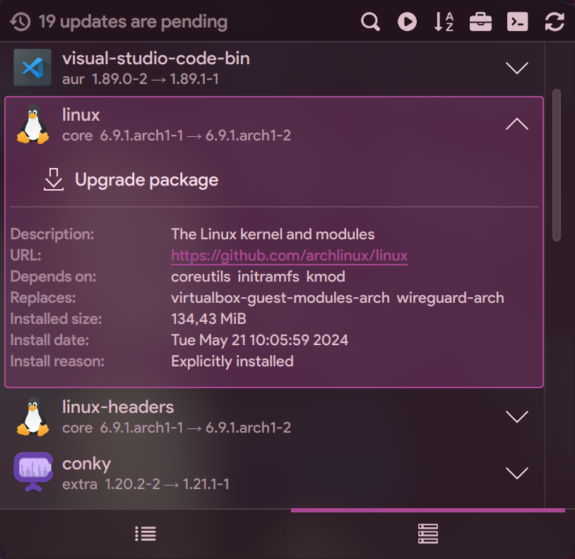
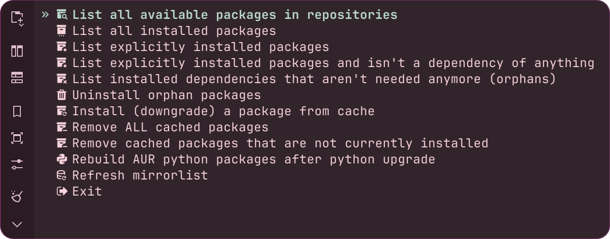

<div align="center">

<!--  -->


# Apdatifier
### Arch Update Notifier

<br>

&nbsp;&nbsp;
&nbsp;&nbsp;


<br>

</div>

# Features
- Searching updates for [pacman](https://archlinux.org/packages/), [AUR](https://aur.archlinux.org/packages), [Plasma Widgets](https://store.kde.org/browse?cat=705), [Flatpak](https://flathub.org), [Firmware](https://fwupd.org/lvfs/vendors/)
- Notification for updates and news
- Bash script with useful options for managing packages
- Two types of lists: compact and extended with additional information
- Button to initiate a full system upgrade in the selected [terminal](#supported-terminals)
- Option to refresh the [mirrorlist](https://archlinux.org/mirrorlist) with the latest mirrors filtered by speed
- Customizable icon on the panel and package icons in the list
- Also should work on non-Arch-based systems (for Plasma Widgets and Flatpak)

<br>

# Screenshots

<div align="center">

#### Compact/Extended list

&nbsp;&nbsp;&nbsp;

&nbsp;&nbsp;&nbsp;

<br>

#### Full system upgrade


<br>

#### Management


<br><br>

https://github.com/exequtic/apdatifier/assets/29355358/9751fc8f-29c2-4f7d-8f1f-c346c0748df3

</div>

<br>

# Requirements
## Optional dependencies
- `paru`, `yay`, `pikaur` - for AUR updates support
- `flatpak` - for Flatpak updates support
- `fwupdmgr` - for Firmware updates support
- `jq` - for KDE Widgets updates and News
- `tmux` - for upgrade and management in a terminal multiplexer
- `fzf` - for interactive package selection in management

### Supported terminals
alacritty, foot, gnome-terminal, ghostty, konsole, kitty, lxterminal, ptyxis, terminator, tilix, xterm, yakuake, wezterm

<br>

# Translation
Feel free to help translate to new languages or update and improve the ones that are already available. Please refer to the [ReadMe.md](https://github.com/exequtic/apdatifier/blob/main/package/translate/ReadMe.md) for instructions on how to do it.

<br>

# Installation

Just install directly from KDE Widget Store ("+ Add widgets..." -> "Get New Widgets..." -> "Download New Plasma Widgets").

After installation, you can either enable it to appear in the system tray or place it on the panel or desktop instead.


### Update to the latest commit
```
Settings -> General -> Misc -> Install Development version
```

If script doesn't work, you can do it manually:

```bash
git clone -n --depth=10 --filter=tree:0 -b main https://github.com/exequtic/apdatifier
cd apdatifier
git sparse-checkout set --no-cone package
git checkout
kpackagetool6 -t Plasma/Applet -u ./package
systemctl --user restart plasma-plasmashell.service
```

<br>

# Uninstalling
Uninstall plasmoid and remove all related files (config, icons, notifyrc):

```bash
bash ~/.local/share/plasma/plasmoids/com.github.exequtic.apdatifier/contents/tools/sh/utils uninstall
```

<br>

# Support the project
<a href="https://www.buymeacoffee.com/evgk" target="_blank" title="buymeacoffee.com">
  
</a>
<br>
<a href="https://nowpayments.io/donation/exequtic" target="_blank" title="nowpayments.io">
   
</a>

<br>
