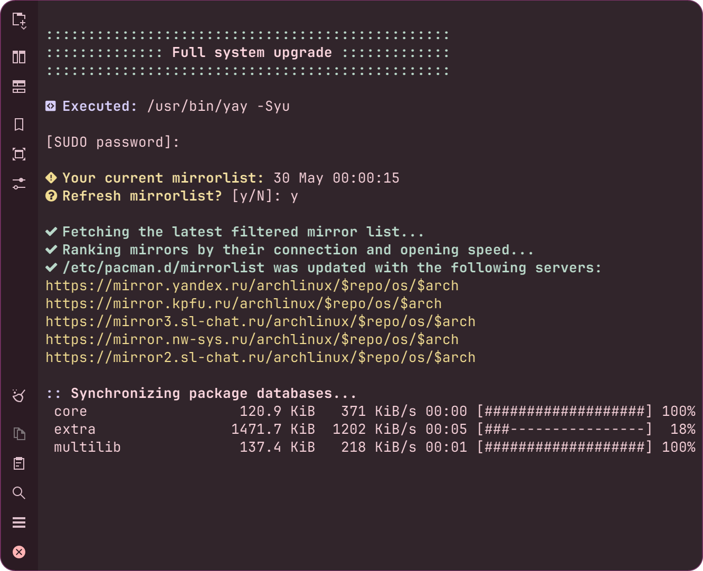

<div align="center">


# Apdatifier
## Arch Update Notifier

</div>

# Features
- Choice between pacman, checkupdates, pacman [wrappers](#wrappers)
- Supports Flatpak (without showing the runtime updates)
- Work on any distro, but only Arch Linux will support system updates, while in other, only Flatpak will be supported.
- Notification for new updates
- Button for downloading fresh package databases
- Button to initiate a full system upgrade in the selected [terminal](#terminals)
- Customizable icon on the panel and update list
- The list with updates is presented as a table, so you can rearrange columns, resize them, and sort by name/repository.

<br>

<div align="center">


</div>

<br>

# Requirements
>[!WARNING]
>Before install plasmoid, make sure you have the org.kde.notification qml module installed

Arch Linux
```bash
sudo pacman -S knotifications5
```

KDE Neon
```bash
sudo apt install qml-module-org-kde-notification
```

Kubuntu
```bash
sudo apt install qml-module-org-kde-notifications
```

Fedora
```bash
sudo dnf install kf5-knotification
```

### Steam Deck
If you haven't done this before:
```bash
sudo steamos-readonly disable
sudo pacman-key --init
sudo pacman-key --populate archlinux
```

<h2 id="wrappers">Supported pacman wrappers</h2>
aura, aurman, pacaur, pakku, paru, picaur, trizen, yay.


<h2 id="terminals">Supported terminals</h2>
alacritty, foot, gnome-terminal, konsole, kitty, lxterminal, terminator, tilix, xterm, yakuake.

<br>

# Installation
Download latest release and install plasmoid in oneline command:
```bash
curl -fsSL https://raw.githubusercontent.com/exequtic/apdatifier/main/package/contents/tools.sh | sh -s install
```
<br>

# Translation
You can translate this widget into other languages. Please refer to the [ReadMe.md](https://github.com/exequtic/apdatifier/blob/main/package/translate/ReadMe.md) for instructions on how to do it.

### Current status:
```markdown
|  Locale  |  Lines  | % Done|
|----------|---------|-------|
| English  |      77 |       |
| Russian  |   77/77 |  100% |
|----------|---------|-------|
```
<br>


<div align="center">

# Screenshots


---

---

---

---


</div>


